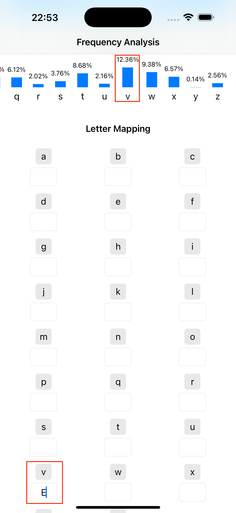
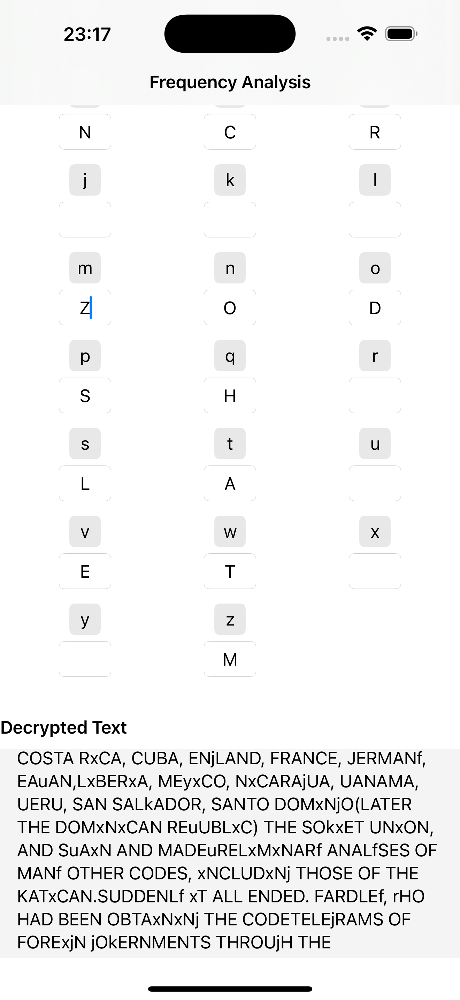
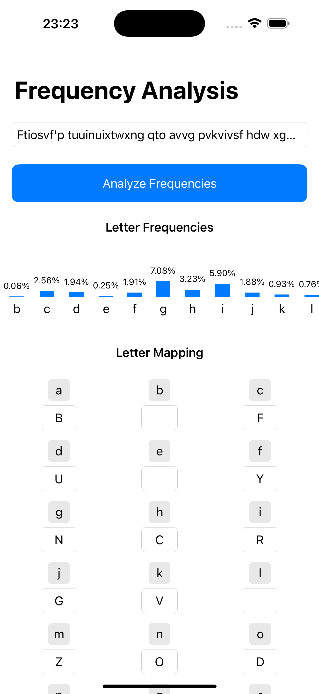

# Laboratory Report: Frequency Analysis and Decryption

## Task Description
Build a small app that takes in some ciphertext and applies frequency analysis to decipher and find the original text. The original text is in English.

---

## Implementation

### Step 1: Analyze Frequencies
To start, we initialize the frequencies of English letters. This includes single letters as well as combinations of 2, 3, and 4 letters (e.g., digrams, trigrams). We then analyze the ciphertext to compute the frequencies of these combinations.

#### Code Example for Frequency Analysis in Swift
The following function calculates letter frequencies and supports combinations of up to 4 letters:

```swift
import Foundation

func getWordPartsFrequencies(text: String, nrOfLetters: Int, maxParts: Int? = nil) -> [String: (count: Int, frequency: Double)] {
    guard !text.isEmpty else {
        fatalError("No text provided")
    }
    guard nrOfLetters > 0 else {
        fatalError("Number of letters must be greater than zero")
    }

    let words = text.components(separatedBy: " ")
    let wordParts = words.flatMap { word in
        (0...(word.count - nrOfLetters)).compactMap { index in
            let startIndex = word.index(word.startIndex, offsetBy: index)
            let endIndex = word.index(startIndex, offsetBy: nrOfLetters, limitedBy: word.endIndex)
            return endIndex != nil ? String(word[startIndex..<endIndex!]).uppercased() : nil
        }
    }

    let totalParts = wordParts.count
    var wordPartCounts = Dictionary(wordParts.map { ($0, 1) }, uniquingKeysWith: +)

    if let maxParts = maxParts {
        wordPartCounts = wordPartCounts.sorted(by: { $0.value > $1.value })
                                       .prefix(maxParts)
                                       .reduce(into: [String: Int]()) { $0[$1.key] = $1.value }
    }

    return wordPartCounts.mapValues { count in
        (count: count, frequency: round((Double(count) / Double(totalParts)) * 10000) / 100.0)
    }
}
```

### Step 2: Replace the Most Frequent Letter with E
In English, the letter E is the most frequently used. We begin the decryption process by identifying the most frequent letter in the ciphertext and replacing it with E.



### Step 3: Replace Characters Based on Patterns
After replacing the most frequent letter, we analyze specific sections of the ciphertext to identify common words or patterns. This allows us to make additional substitutions.

#### Observations:
1. The section `FtiosEf'p` likely corresponds to **"History's"**, as it fits the context and structure.
   - **Replace `P` with `S`**.

2. The phrase `cinz 1917 wn 1929` likely corresponds to **"from 1917 to 1929"**.
   - **Replace `C` with `F`.**
   - **Replace `I` with `R`.**
   - **Replace `N` with `O`.**
   - **Replace `Z` with `M`.**
   
### Step 4: Refine Substitutions with Easy Combinations
In this step, we use the partially decrypted text to identify additional substitutions based on recognizable patterns and common English words.

#### Observations and Replacements:
1. The phrase **`MORE Tqtg 45,000`** looks like **"more than 45,000"**.
   - **Replace `Q` with `H`.**
   - **Replace `T` with `A`.**
   - **Replace `G` with `N`.**

2. The section **`HAo aEEg`** looks like **"has been"**.
   - **Replace `O` with `S`.**
   - **Replace `E` with `B`.**

3. The phrase **`hasf thestaff`** looks like **"half the staff"**.
   - **Replace `F` with `L`.**

4. The phrase **`the forhe to abodt a domen`** looks like **"the force to about a dozen"**.
   - **Replace `R` with `C`.**
   - **Replace `D` with `U`.**
   - **Replace `M` with `Z`.**
   
Here we are halfway done and here's how the table is looking



### Step 5: Country Names
At this stage, we can clearly identify the names of several countries within the ciphertext. By recognizing these patterns, we make further replacements to uncover the plaintext.

#### Observations and Replacements:
1. The phrase **`ARjENTxNA`** corresponds to **"ARGENTINA"**.
   - **Replace `J` with `G`.**
   - **Replace `X` with `I`.**

2. The phrase **`BRAZxL`** corresponds to **"BRAZIL"**.
   - **`X` to `I`** (already replaced).

3. The phrase **`CHxLE`** corresponds to **"CHILE"**.

4. The phrase **`CHxNA`** corresponds to **"CHINA"**.

5. The phrase **`COSTA RxCA`** corresponds to **"COSTA RICA"**.
   - **Replace `R` with `C`.**

6. The phrase **`JERMANf`** corresponds to **"GERMANY"**.
   - **Replace `F` with `Y`.**

7. The phrase **`EAuAN`** corresponds to **"JAPAN"**.
   - **Replace `E` with `J`.**
   - **Replace `U` with `P`.**

8. The phrase **`LxBERxA`** corresponds to **"LIBERIA"**.

9. The phrase **`MEyxCO`** corresponds to **"MEXICO"**.

10. The phrase **`NxCARAjUA`** corresponds to **"NICARAGUA"**.

11. The phrase **`UANAMA`** corresponds to **"PANAMA"**.

12. The phrase **`UERU`** corresponds to **"PERU"**.

13. The phrase **`SAN SALkADOR`** corresponds to **"SAN SALVADOR"**.
    - **Replace `K` with `V`.**

14. The phrase **`SANTO DOMxNjO`** corresponds to **"SANTO DOMINGO"**.

15. The phrase **`DOMxNxCAN REuUBLxC`** corresponds to **"DOMINICAN REPUBLIC"**.

16. The phrase **`SOkxET UNxON`** corresponds to **"SOVIET UNION"**.
    - **Replace `K` with `V`.**

17. The phrase **`SuAxN`** corresponds to **"SPAIN"**.

### Step 6: Final Tweaks
With the remaining untouched letters, which are `B`, `E`, and `L`, it's easy to deal with. However, they are found very rarely. See the screenshot below:



#### Final Replacements:
1. **`E` → `M`**
2. **`L` → `K`**
3. **`B` → `Q`**

---

#### Updated Text After Final Replacements
After applying these final tweaks, the plaintext becomes fully readable:

``` Decyphered Text
YARDLEY'S APPROPRIATION HAD BEEN SEVERELY CUT IN 1924, AND HALF THESTAFF HAD TO BE LET GO, REDUCING THE FORCE TO ABOUT A DOZEN. DESPITE THIS,YARDLEY SAID, THE BLACK CHAMBER MANAGED TO SOLVE, FROM 1917 TO 1929,MORE THAN 45,000 TELEGRAMS, INVOLVING THE CODES OF ARGENTINA, BRAZIL,CHILE, CHINA, COSTA RICA, CUBA, ENGLAND, FRANCE, GERMANY, MAPAN,LIBERIA, MEXICO, NICARAGUA, PANAMA, PERU, SAN SALVADOR, SANTO DOMINGO(LATER THE DOMINICAN REPUBLIC) THE SOVIET UNION, AND SPAIN AND MADEPRELIMINARY ANALYSES OF MANY OTHER CODES, INCLUDING THOSE OF THE VATICAN.SUDDENLY IT ALL ENDED. YARDLEY, WHO HAD BEEN OBTAINING THE CODETELEGRAMS OF FOREIGN GOVERNMENTS THROUGH THE COOPERATION OF THEPRESIDENTS OF THE WESTERN UNION TELEGRAPH COMPANY AND THE POSTALTELEGRAPH COMPANY, WAS ENCOUNTERING INCREASING RESISTANCE FROM THEM.HERBERT HOOVER HAD MUST BEEN INAUGURATED, AND YARDLEY RESOLVED TO SETTLE THE MATTER WITH THE NEW ADMINISTRATION ONCE AND FOR ALL. HEDECIDED ON THE BOLD STROKE OF DRAWING UP "A MEMORANDUM TO BEPRESENTED DIRECTLY TO THE PRESIDENT, OUTLINING THE HISTORY AND ACTIVITIES OFTHE BLACK CHAMBER, AND THE NECESSARY STEPS THAT MUST BE TAKEN IF THEGOVERNMENT HAD HOPED TO TAKE FULL ADVANTAGE OF THE SKILL OF ITSCRYPTOGRAPHERS." HE WAITED TO SEE WHICH WAY THE WIND WAS BLOWING BEFOREMAKING HIS MOVE—AND FOUND THAT IT WAS NOT WITH HIM. YARDLEY WENT TO ASPEAKEASY TO LISTEN TO HOOVER'S FIRST SPEECH AS PRESIDENT AND SENSED, INTHE HIGH ETHICAL STRICTURES THAT HOOVER EXPRESSED, THE DOOM OF THE BLACKCHAMBER.HE WAS RIGHT, THOUGH ITS ACTUAL CLOSING CAME FROM ELSEWHERE. AFTERHENRY L. STIMSON, HOOVER'S SECRETARY OF STATE, HAD BEEN IN OFFICE THE FEWMONTHS THAT YARDLEY THOUGHT WOULD BE NECESSARY FOR HIM TO HAVE LOSTSOME OF HIS INNOCENCE IN WRESTLING WITH THE HARDHEADED REALITIES OFDIPLOMACY, THE BLACK CHAMBER SENT HIM THE SOLUTION OF AN IMPORTANTSERIES OF MESSAGES. BUT STIMSON WAS DIFFERENT FROM PREVIOUS SECRETARIESOF STATE, ON WHOM THIS TACTIC HAD ALWAYS WORKED. HE WAS SHOCKED TOLEARN OF THE EXISTENCE OF THE BLACK CHAMBER, AND TOTALLY DISAPPROVED OF IT.HE REGARDED IT AS A LOW, SNOOPING ACTIVITY, A SNEAKING, SPYING, KEYHOLE-PEERING KIND OF DIRTY BUSINESS, A VIOLATION OF THE PRINCIPLE OF MUTUAL TRUSTUPON WHICH HE CONDUCTED BOTH HIS PERSONAL AFFAIRS AND HIS FOREIGNPOLICY. ALL OF THIS IT IS, AND STIMSON REMECTED THE VIEW THAT SUCH MEANSMUSTIFIED EVEN PATRIOTIC ENDS. HE HELD TO THE CONVICTION THAT HIS COUNTRYSHOULD DO WHAT IS RIGHT, AND, AS HE SAID LATER, "GENTLEMEN DO NOT READEACH OTHER'S MAIL." IN AN ACT OF PURE MORAL COURAGE, STIMSON, AFFIRMINGPRINCIPLE OVER EXPEDIENCY, WITHDREW ALL STATE DEPARTMENT FUNDS FROM THESUPPORT OF THE BLACK CHAMBER.* SINCE THESE CONSTITUTED ITS MAMORINCOME, THEIR LOSS SHUTTERED THE OFFICE. HOOVER'S SPEECH HAD WARNEDYARDLEY THAT AN APPEAL WOULD BE FRUITLESS. THERE WAS NOTHING TO DO BUTCLOSE UP SHOP.IN 1940, AS SECRETARY OF WAR, HE HAD TO REVERSE HIMSELF AND ACCEPTTHE CRYPTANALYSES OF MAGIC. BUT THE INTERNATIONAL SITUATION THEN WASTOTALLY DIFFERENT. "IN 1929," HE HIMSELF HAS WRITTEN, IN THE THIRD PERSON,"THE WORLD WAS STRIVING WITH GOOD WILL FOR LASTING PEACE, AND IN THIS EFFORTALL THE NATIONS WERE PARTIES. STIMSON, AS SECRETARY OF STATE, WAS DEALINGAS A GENTLEMAN WITH THE GENTLEMEN SENT AS AMBASSADORS AND MINISTERSFROM FRIENDLY NATIONS. ..." IN 1940, EUROPE WAS AT WAR, AND THE UNITEDSTATES WAS ON THE VERGE.THE SIGNAL CORPS, WHERE WILLIAM FRIEDMAN HAD CHARGE OF CRYPTOLOGY.THE STAFF QUICKLY DISPERSED (NONE WENT TO THE ARMY), AND WHEN THE BOOKSWERE CLOSED ON OCTOBER 31, 1929, THE AMERICAN BLACK CHAMBER HADPERISHED. IT HAD COST THE STATE DEPARTMENT $230,404 AND THE WARDEPARTMENT $98,808.49—MUST UNDER A THIRD OF A MILLION DOLLARS FOR ADECADE OF CRYPTANALYIS. YARDLEY, WHOSE MOB EXPERIENCE HAD BEEN RATHER SPECIALIZED, COULD NOTFIND WORK, AND HE WENT BACK HOME TO WORTHINGTON. THE DEPRESSIONSUCKED HIM DRY. BY AUGUST OF 1930, HE HAD HAD TO GIVE UP AN APARTMENTHOUSE AND A ONE-EIGHTH INTEREST IN A REAL ESTATE CORPORATION; INDEED, HECOMPLAINED THAT HE HAD TO SELL NEARLY EVERYTHING HE OWNED "FOR LESS THANNOTHING." A FEW MONTHS LATER HE WAS TOYING WITH THE IDEA OF WRITING THESTORY OF THE BLACK CHAMBER TO MAKE SOME MONEY TO FEED HIS WIFE ANDTHEIR SON, MACK. WHEN HIS OLD MI-8 FRIEND, MANLY, WITH WHOM HE HADBEEN IN CONTACT ALL DURING THE 1920'S, HAD TO TURN DOWN HIS REQUEST FOR A$2,500 LOAN AT THE END OF MANUARY, 1931, YARDLEY, IN DESPERATION, SATDOWN TO WRITE WHAT WAS TO BE THE MOST FAMOUS BOOK ON CRYPTOLOGY EVERPUBLISHED.

```


### Conclusion
This project successfully decrypts ciphertext using frequency analysis in Swift. The approach combines programmatic letter frequency analysis with manual replacement steps, leveraging known English patterns and statistical probabilities.


